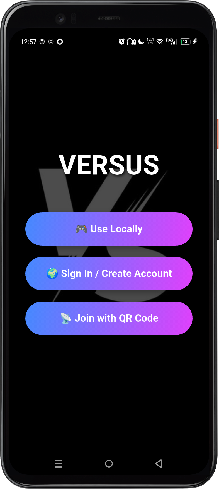
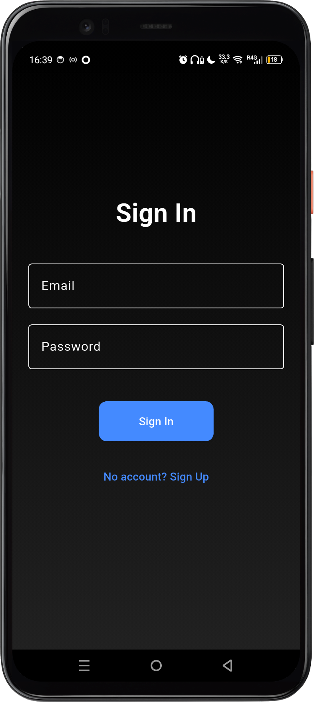
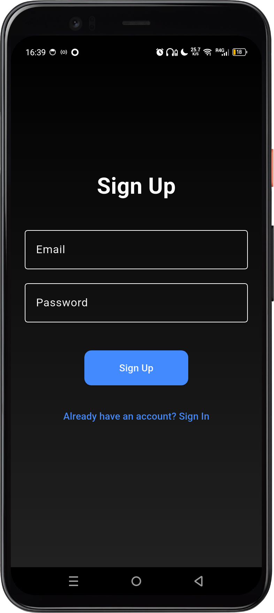
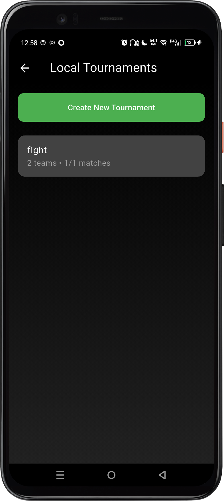
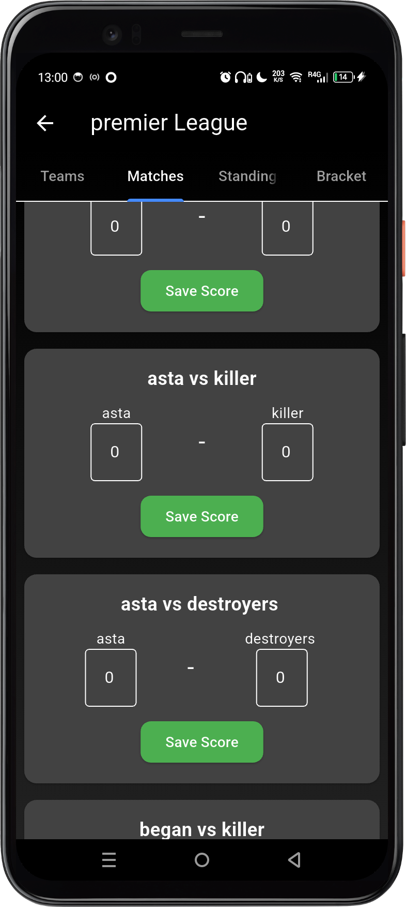
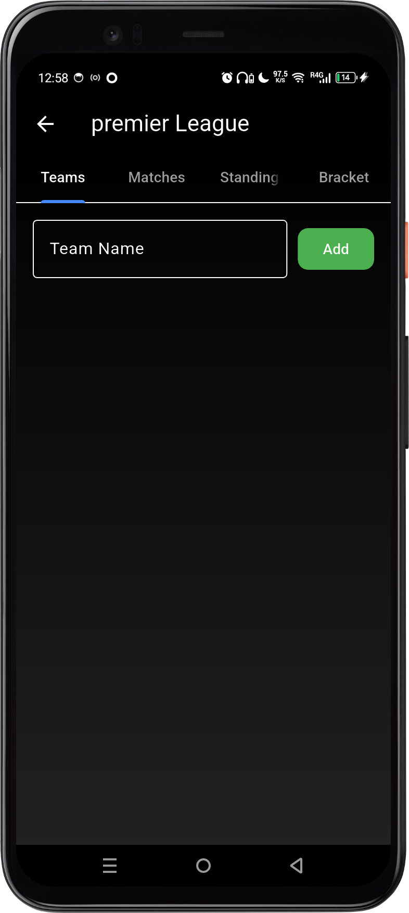
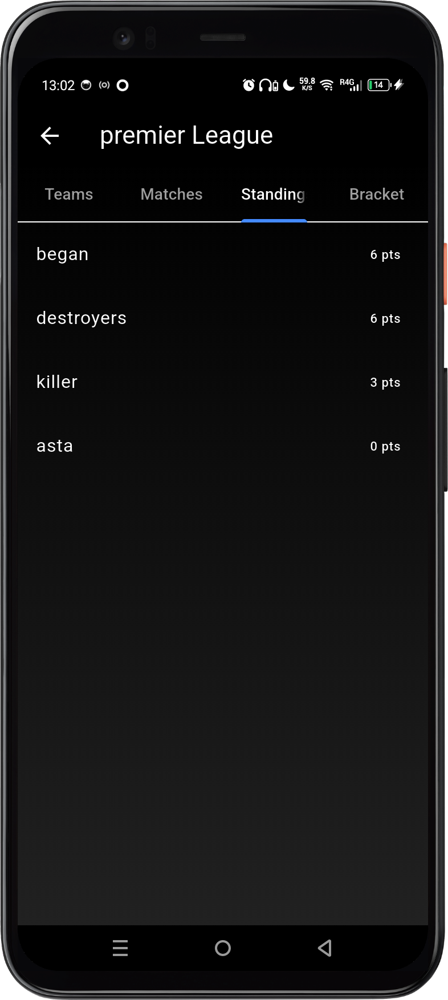
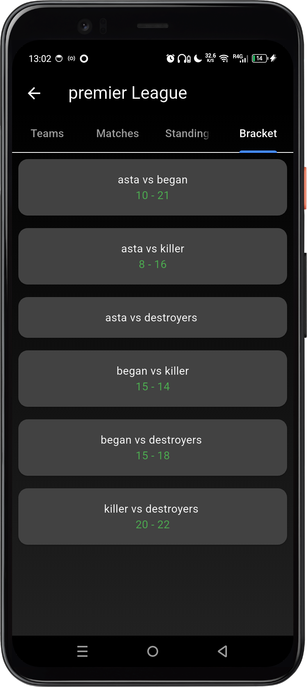

# 🏆 Versus – Tournament Organizer App

Versus is a **Flutter-based tournament management application** that allows users to **create, join, and manage competitive tournaments** easily.

The application supports both **offline (local)** and **online (Firebase)** modes, making it flexible for casual games between friends or organized online competitions.

---

# 📌 Current Development Status

The project is **currently under development**.  
Some core features are already implemented and working.

## ✅ Features Already Implemented

### Local Mode
The following features are **fully functional locally**:

- Tournament creation in **local mode**
- Team score management
- Automatic **team ranking / leaderboard**
- Local data storage on the **phone/device**
- Match score recording

All data is saved **locally on the device storage**.

---

### Online System

The following **online features are already working**:

- User **account registration**
- Firebase **authentication system**
- **QR Code generator** for tournaments
- **QR Code scanner** to join tournaments

The online system is connected to **Firebase** for authentication and tournament sharing.

---

# 📌 Features (Full Vision)

## 🔹 1. Dual Mode System

### Local Mode (Offline)
Users can use the application **without creating an account**.

Features available in local mode:

- Create tournaments locally
- Add up to **8 teams**
- Configure match types:
  - **1 vs 1**
  - **2 vs 2**
  - **3 vs 3**
  - **4 vs 4**
  - **5 vs 5**
- Generate **automatic tournament brackets**
- Create **match schedules**
- Add **match timers**
- Record match results
- Track tournament progression

All data is stored **locally on the device**.

---

### Online Mode (Account Required)

Users can create an account and access **online tournament features**.

Online features include:

- User registration and login
- Create online tournaments
- Join existing tournaments
- View active tournaments
- Add teams to tournaments
- Share tournament via **QR Code**
- Scan QR code to join tournament instantly
- Real-time tournament updates

Online data is handled using **Firebase services**.

---

# 🏗️ Project Architecture

The project follows a **modular Flutter architecture** for better scalability.

```
lib/
│
├── main.dart
│
├── screens/
│   ├── home_page.dart
│   ├── login_page.dart
│   ├── register_page.dart
│   ├── create_tournament_page.dart
│   ├── join_tournament_page.dart
│   ├── tournament_dashboard.dart
│   ├── local_tournament_page.dart
│
├── widgets/
│   ├── team_card.dart
│   ├── match_card.dart
│   ├── bracket_widget.dart
│
├── models/
│   ├── tournament_model.dart
│   ├── team_model.dart
│   ├── match_model.dart
│
├── services/
│   ├── firebase_service.dart
│   ├── auth_service.dart
│   ├── tournament_service.dart
│
└── utils/
    ├── qr_generator.dart
    ├── qr_scanner.dart
    ├── match_timer.dart
```

---

# 🛠️ Technologies Used

| Technology | Purpose |
|------------|--------|
| Flutter | Cross-platform mobile development |
| Dart | Programming language |
| Firebase Authentication | User login & registration |
| Cloud Firestore | Online tournament database |
| QR Code Generator | Tournament sharing |
| QR Code Scanner | Joining tournaments |
| Material UI | Interface design |

---

# 📱 Application Flow

## Home Page

Users are presented with two main choices:

- **Use App Locally**
- **Login / Create Account**

---

## Local Mode Flow

```
Home
 ↓
Local Mode
 ↓
Create Tournament
 ↓
Add Teams (max 8)
 ↓
Generate Bracket
 ↓
Schedule Matches
 ↓
Start Tournament
 ↓
Record Results
```

---

## Online Mode Flow

```
Login / Register
 ↓
Tournament Dashboard
 ↓
Create Tournament
 OR
Join Tournament
 ↓
Add Teams
 ↓
Generate Matches
 ↓
Share QR Code
 ↓
Live Tournament Management
```

---

# 📊 Tournament System

## Supported Match Types

- 1 vs 1
- 2 vs 2
- 3 vs 3
- 4 vs 4
- 5 vs 5

---

## Tournament Rules

- Maximum **8 teams**
- Automatic **random draw**
- Automatic **match scheduling**
- Optional **match timer**
- Score recording for each match

---

# 🔳 QR Code System

Each tournament generates a **unique QR code**.

This allows players to:

- Scan the code
- Instantly join the tournament
- Automatically load the tournament information

---

# 🔐 Authentication System

The online system uses **Firebase Authentication**.

Supported authentication:

- Email / Password login
- Account registration
- Secure user sessions

---

# 🗄️ Database Structure (Firestore)

Example database structure:

```
users
 ├── userID
      ├── name
      ├── email

tournaments
 ├── tournamentID
      ├── name
      ├── ownerID
      ├── teams
      ├── matches
      ├── status
```

---

# 🚀 Installation

## 1️⃣ Clone the repository

```bash
git clone https://github.com/yourusername/versus.git
```

---

## 2️⃣ Navigate to the project

```bash
cd versus
```

---

## 3️⃣ Install dependencies

```bash
flutter pub get
```

---

## 4️⃣ Configure Firebase

Install FlutterFire CLI:

```bash
dart pub global activate flutterfire_cli
```

Then configure Firebase:

```bash
flutterfire configure
```

---

## 5️⃣ Run the application

```bash
flutter run
```

---

# 📸 Screenshots

## 🏠 Home Page
<p align="center">
  
</p>

---

## 🔐 Sign In
<p align="center">
  
</p>

---

## 📝 Sign Up
<p align="center">
  
</p>

---

## 🏆 Tournament
<p align="center">
  
</p>

---

## ⚔️ Matches
<p align="center">
  
</p>

---

## 👥 Teams
<p align="center">
  
</p>

---

## 📊 Standings
<p align="center">
  
</p>

---

## 🧩 Tournament Bracket
<p align="center">
  
</p>

# 🎯 Future Improvements

Possible improvements for the project:

- Live score updates
- Tournament leaderboard
- Push notifications
- Player profiles
- Tournament history
- Spectator mode
- Cloud synchronization for local tournaments

---

# 👨‍💻 Author

Developed by:

**Christian Salifou Aleheri**

Flutter Developer & AI Enthusiast

---

# 📄 License

This project is open-source and available under the **MIT License**.

---

# ⭐ Contribution

Contributions are welcome.

If you'd like to improve this project:

1. Fork the repository  
2. Create a new branch  
3. Submit a pull request  

---

# ❤️ Acknowledgments

Thanks to the Flutter and Firebase communities for the tools and documentation that made this project possible.